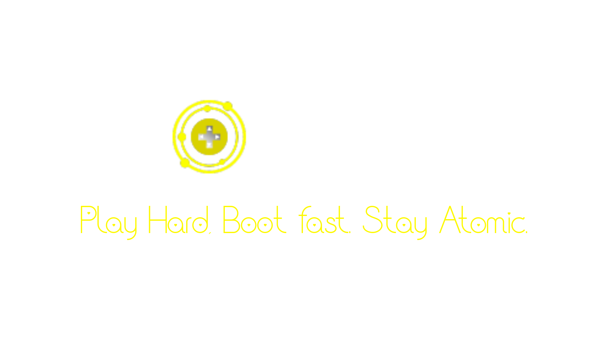

# 🎮 Atomix Linux

**Atomix Linux** is an immutable, Flatpak-centric Linux distribution for gamers. Built on Arch Linux distro, Atomix provides a stable, minimal base with containerized gaming apps, Atomic updates, and GPU-ready profiles.

---

## 🚀 Key Features

- 🔒 **Immutable base system** via Zenkai Updater
- 🎮 **Gaming-Ready** out of the box with Steam, Heroic, Lutris and more...
- 📦 **Flatpak-first** approach for all user apps

## 📥 Installation Process
> Requirments x86_64 system, 4 GB RAM, 50 GB Space

### By ISO
- Not Ready Yet
